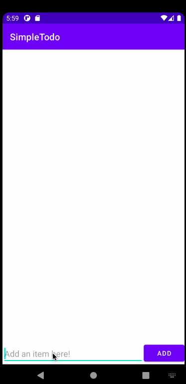

# Project 1 - Simple Todo

**Simple Todo** is an android app that allows building a todo list and basic todo items management functionality including adding new items, editing and deleting an existing item.

Submitted by: **Jorge Cabiedes Acosta**

Time spent: **4** hours spent in total

## User Stories

The following **required** functionality is completed:

* [x] User can **view a list of todo items**
* [x] User can **successfully add and remove items** from the todo list
* [x] User's **list of items are persisted** across app restarts

The following **bonus** features are implemented:

* [x] User can **tap a todo item in the list and bring up an edit screen for the todo item** and then have any changes to the text reflected back in the todo list

The following **additional** features are implemented:

* [x] List anything else that you can get done to improve the app functionality!
* [ ] Don't Allow whitespaces at the end of a todo item
* [ ] Create an **undo** button
* [ ] Allow color coding for todo items to designate priority

## Video Walkthrough

Here's a walkthrough of implemented user stories:

GIF created with [LICEcap](https://www.cockos.com/licecap/).

## Notes

Describe any challenges encountered while building the app.

It was hard to get the hang of how positioning objects in the design window works, I had to experiment a bit to get it right by playing with the code of the .xml. And definitevely the hardest part to understand was the RecyclerView, the implementation of the ItemsAdapter class was a bit confusing to me and led me to get some code errors, but I was able to disect them using the debug tool and fix them.

## License

    Copyright [yyyy] [name of copyright owner]

    Licensed under the Apache License, Version 2.0 (the "License");
    you may not use this file except in compliance with the License.
    You may obtain a copy of the License at

        http://www.apache.org/licenses/LICENSE-2.0

    Unless required by applicable law or agreed to in writing, software
    distributed under the License is distributed on an "AS IS" BASIS,
    WITHOUT WARRANTIES OR CONDITIONS OF ANY KIND, either express or implied.
    See the License for the specific language governing permissions and
    limitations under the License.
